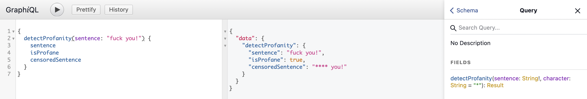

# GraphQL Profanity Filter

This is a Python + Flask demo application showcasing how a GraphQL APIs can be developed to detect, filter, and censor profanity.


## Features

- Detect profanity
- Filter and Censor profanity
- Provide custom character for censoring


## Screenshots




## Tech Stack

- Python
- Flask
- GraphQL


## Run Locally

Clone the project

```bash
git clone https://github.com/LordGhostX/graphql-profanity-filter
```

Go to the project directory

```bash
cd graphql-profanity-filter
```

Install dependencies

```bash
pip3 install -r requirements.txt
```

Start the server

```bash
python3 server.py
```


## Usage/Examples

```graphql
{
  detectProfanity(sentence: "fuck you!") {
    sentence
    isProfane
    censoredSentence
  }
}
```


## License

[MIT](https://choosealicense.com/licenses/mit/)


## Authors

- [@LordGhostX](https://www.github.com/LordGhostX)


## Support

For support, contact [LordGhostX](https://twitter.com/LordGhostX) on Twitter.
